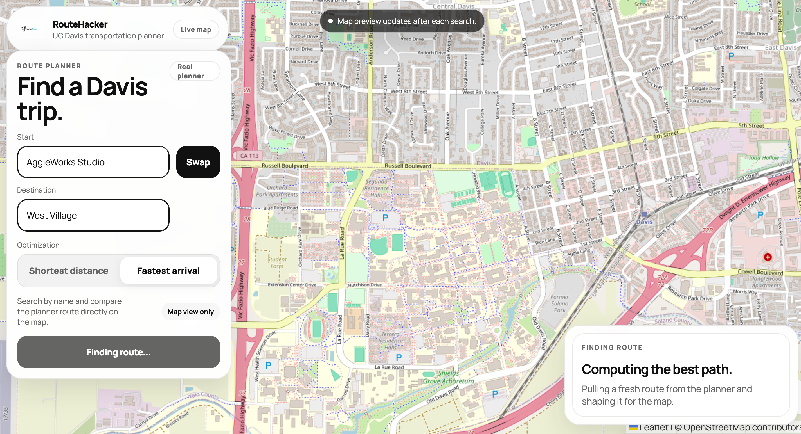
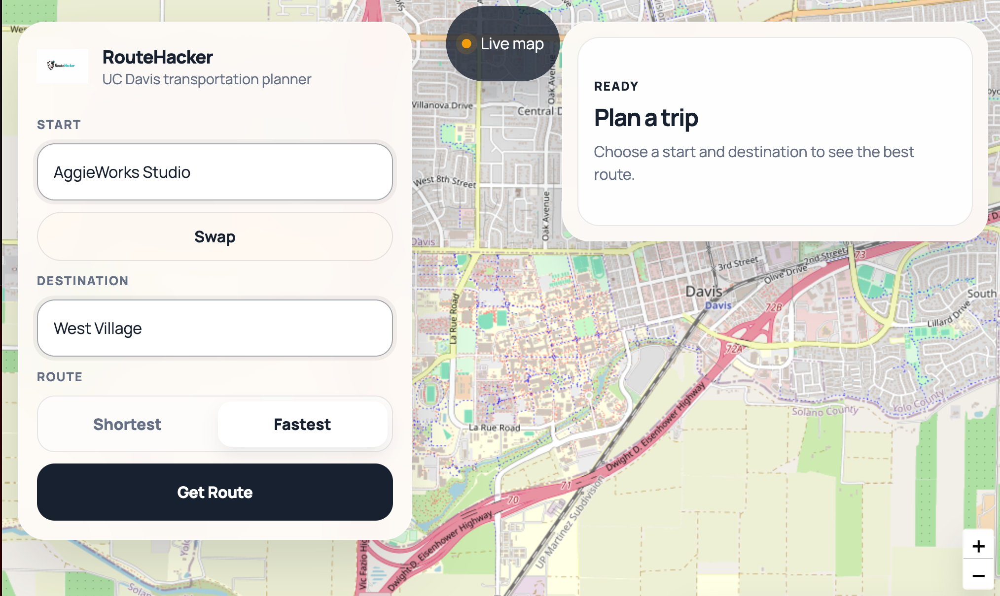
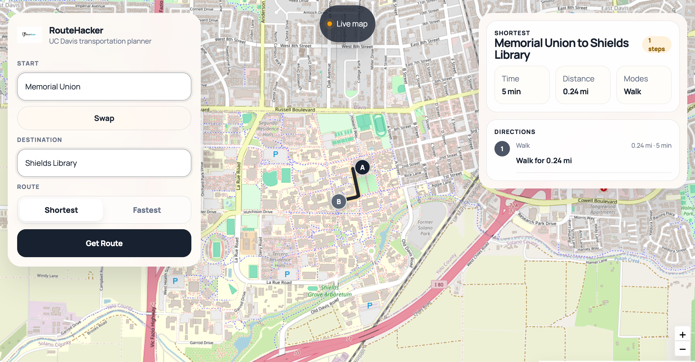
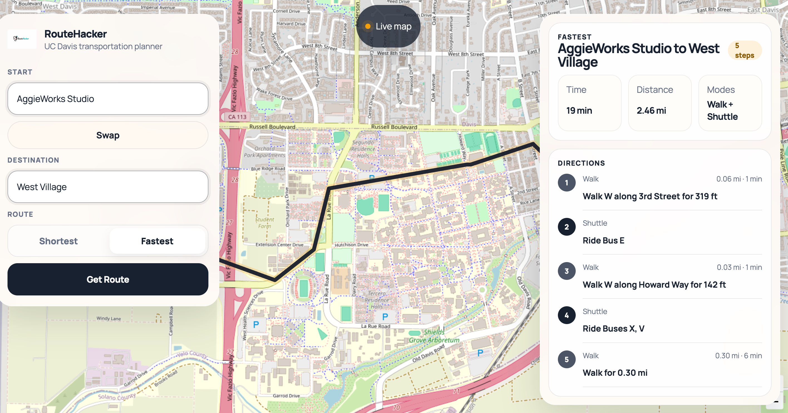

# RouteHacker

RouteHacker is a full-stack transportation planner for UC Davis. It wraps the original ECS 34 C++ routing project in a React frontend and Express API so users can request routes on a real map instead of through a CLI.

The app now runs the real OpenStreetMap-based C++ planner by default for route requests. The frontend is designed as a polished demo surface for that planner: clean trip planning controls, a live map, and compact route output that is easier to scan and trust.

## Live Demo

- Frontend: `https://routehacker.vercel.app`
- Backend API: `https://routehacker-api.onrender.com`

## Screenshots

### Legacy Loading State



### Clean Empty State



### Shortest Route Result



### Fastest Route Result



## Highlights

- React + Vite frontend in `client/`
- Express backend in `server/`
- Real C++ transportation planner from the ECS 34 codebase
- OpenStreetMap + bus-system data from `data/`
- Full-screen Leaflet map with a streamlined route planning UI
- Fastest vs. shortest routing
- Searchable Davis start and destination inputs
- Route normalization layer for cleaner C++ planner output
- Frontend and backend tests
- Dev container support for both C++ and web development

## Architecture

### Request Flow

1. The React app submits `start`, `end`, `optimization`, and `modePreference` to `POST /api/route`.
2. Express validates the request in [server/src/routes/routeRouter.js](/workspaces/RouteApp-AggieWorks/server/src/routes/routeRouter.js).
3. The route service in [server/src/services/routeService.js](/workspaces/RouteApp-AggieWorks/server/src/services/routeService.js) selects the routing engine.
4. The C++ adapter in [src/routeplanner_web.cpp](/workspaces/RouteApp-AggieWorks/src/routeplanner_web.cpp) loads `davis.osm`, `stops.csv`, and `routes.csv`, computes a route, and returns JSON.
5. The backend normalizes the response in [server/src/services/cppPlannerService.js](/workspaces/RouteApp-AggieWorks/server/src/services/cppPlannerService.js) so the UI receives cleaner steps, breakdowns, and summaries.
6. The frontend renders the route geometry, summary metrics, and directions.

## Current Engine Behavior

The app is currently configured to prefer the real C++ planner path.

- Default mode: `cpp`
- Successful C++ responses return `engine: "cpp"`
- If the C++ planner cannot complete, the API returns an error instead of silently switching engines
- The C++ adapter currently supports `modePreference: "any"` only

That means the strongest demo path is:

```json
{
  "start": "aggie_works",
  "end": "west_village",
  "optimization": "fastest",
  "modePreference": "any"
}
```

### Performance Note

The real C++ planner can take noticeably longer than the demo engine in local development. A route request may take around 20 seconds depending on the trip and environment. The backend includes a timeout guard so stalled planner calls fail explicitly instead of hanging forever.

## Key Files

- [src/routeplanner_web.cpp](/workspaces/RouteApp-AggieWorks/src/routeplanner_web.cpp): non-interactive C++ adapter for web requests
- [src/transplanner.cpp](/workspaces/RouteApp-AggieWorks/src/transplanner.cpp): original CLI entry point
- [src/DijkstraTransportationPlanner.cpp](/workspaces/RouteApp-AggieWorks/src/DijkstraTransportationPlanner.cpp): core ECS 34 routing logic
- [server/src/services/cppPlannerService.js](/workspaces/RouteApp-AggieWorks/server/src/services/cppPlannerService.js): Node subprocess bridge and response normalization for the C++ planner
- [server/src/services/routeService.js](/workspaces/RouteApp-AggieWorks/server/src/services/routeService.js): engine selection and request caching
- [server/src/services/legacyRouteService.js](/workspaces/RouteApp-AggieWorks/server/src/services/legacyRouteService.js): seeded JS fallback engine kept for explicit demo/testing use
- [shared/routeOptions.js](/workspaces/RouteApp-AggieWorks/shared/routeOptions.js): shared UI metadata and location coordinates

## Local Setup

### Dev Container

Open the repository in the provided dev container at [.devcontainer/devcontainer.json](/workspaces/RouteApp-AggieWorks/.devcontainer/devcontainer.json). It includes both the C++ toolchain and the Node-based web stack.

### Install Dependencies

From the repo root:

```bash
npm install
```

### Set Environment Variables

Create `client/.env` from `client/.env.example` and set:

```bash
VITE_API_BASE_URL=http://localhost:3000
```

### Build the C++ Web Adapter

From the repo root:

```bash
npm run build:planner
```

That builds:

```text
bin/routeplanner_web
```

### Run the App

```bash
npm run dev
```

That starts:

- the API at `http://localhost:3000`
- the client at `http://localhost:5173`

## Engine Control

The backend supports the following engine modes through `ROUTE_ENGINE`:

- `cpp`: require the C++ planner
- `demo`: use the seeded JS graph
- `auto`: use the C++ planner when available, otherwise fall back

Example:

```bash
ROUTE_ENGINE=cpp npm run dev --workspace server
```

If you need more time for the real planner locally, you can raise the timeout:

```bash
CPP_PLANNER_TIMEOUT_MS=30000 npm run dev
```

## API Contract

`POST /api/route`

Request body:

```json
{
  "start": "aggie_works",
  "end": "west_village",
  "optimization": "fastest",
  "modePreference": "any"
}
```

Success response includes:

- `summary`
- `optimization`
- `modePreference`
- `totals`
- `geometry`
- `steps`
- `breakdown`
- `explanation`
- `highlights`
- `engine`

The API also exposes `GET /api/health`.

## Testing

Useful commands:

```bash
npm run test
npm run test:server
npm run test:client
npm run build
make
```

The automated server tests explicitly run in demo mode for determinism and speed. The real C++ path was validated separately by compiling `bin/routeplanner_web` and exercising it through the Express service.

## Legacy Planner

The original ECS 34 Project 4 C++ planner still lives in:

- `src/`
- `include/`
- `testsrc/`
- `Makefile`

That preserves the original course project structure while RouteHacker demonstrates how to turn the planner into a product-facing web app.
